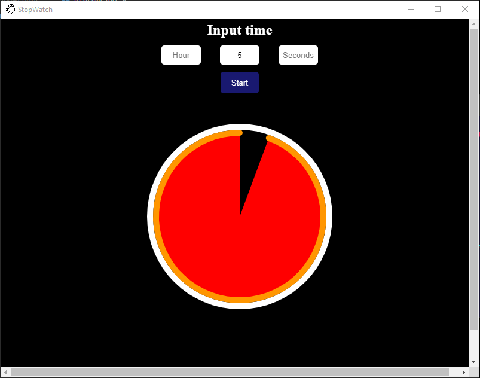

# Stopwatch

A simple stopwatch app to help with productivity when programming using [electronJS](https://www.electronjs.org) and [p5JS](https://p5js.org).

## Requirements

Assuming you have [npm](https://www.npmjs.com) installed, clone the repo and run the following code inside the stopwatch folder:

```
npm install
```

## Usage

Inside the cloned stopwatch folder run:

```
npm start
```

## Build executable

Inside the cloned stopwatch folder run:

```
npm run build
```

Then you will find the executable files to install the app for your system in the out folder.

## Examples

<p align="center">
   
</p>
